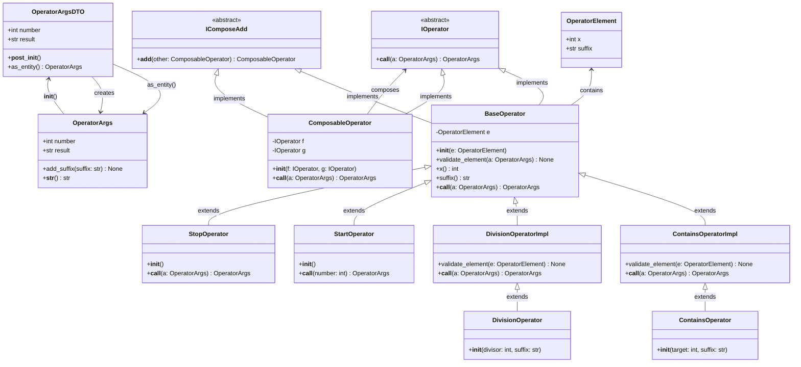

プロダクトレベルのFizzBuzz

{/* truncate */}


なんか話題になっていた、絶対にソースコードを書き換えたくない人のためのFizzBuzz。

-> [Paiza実行結果](https://paiza.io/projects/__AR8kcD0pOuei2oC0gf3g)


## 自動生成したクラス図




## ソースコード

```python
from abc import ABC, abstractmethod
from dataclasses import dataclass
from typing import Union


@dataclass
class OperatorArgsDTO:
    number: int
    result: str

    def __post_init__(self):
        if not isinstance(self.number, int):
            raise TypeError("number must be an integer")
        if not isinstance(self.result, str):
            raise TypeError("result must be a string")

    def as_entity(self) -> "OperatorArgs":
        return OperatorArgs(self)


class OperatorArgs:
    def __init__(self, dto: OperatorArgsDTO):
        self.number = dto.number
        self.result = dto.result

    def add_suffix(self, suffix: str) -> None:
        self.result += suffix

    def __str__(self) -> str:
        return f"OperatorArgs({self.number}, {self.result})"


@dataclass(frozen=True)
class OperatorElement:
    x: int
    suffix: str


class IOperator(ABC):

    @abstractmethod
    def __call__(self, a: OperatorArgs) -> OperatorArgs: ...


class IComposeAdd(ABC):

    def __add__(self, other: "ComposableOperator") -> "ComposableOperator":
        return ComposableOperator(self, other)


class ComposableOperator(IComposeAdd, IOperator):

    def __init__(self, f: IOperator, g: IOperator):
        self.f = f
        self.g = g

    def __call__(self, a: OperatorArgs) -> OperatorArgs:
        return self.g(self.f(a))


class BaseOperator(IComposeAdd, IOperator):
    def __init__(self, e: OperatorElement):
        self.validate_element(e)
        self.e = e

    def validate_element(self, a: OperatorArgs) -> None: ...

    @property
    def x(self):
        return self.e.x

    @property
    def suffix(self):
        return self.e.suffix

    @abstractmethod
    def __call__(self, a: OperatorArgs) -> OperatorArgs:
        raise NotImplementedError


class ContainsOperatorImpl(BaseOperator):

    def validate_element(self, e: OperatorElement) -> None:
        pass

    def __call__(self, a: OperatorArgs) -> OperatorArgs:
        b = OperatorArgsDTO(a.number, a.result).as_entity()
        if str(self.x) in str(a.number):
            b.add_suffix(self.suffix)
        return b


class ContainsOperator(ContainsOperatorImpl):

    def __init__(self, target: int, suffix: str):
        super().__init__(OperatorElement(target, suffix))


class DivisionOperatorImpl(BaseOperator):

    def validate_element(self, e: OperatorElement) -> None:
        if e.x == 0:
            raise ValueError("x must be a non-zero integer")

    def __call__(self, a: OperatorArgs) -> OperatorArgs:
        b = OperatorArgsDTO(a.number, a.result).as_entity()
        if a.number % self.x == 0:
            b.add_suffix(self.suffix)
        return b


class DivisionOperator(DivisionOperatorImpl):

    def __init__(self, divisor: int, suffix: str):
        super().__init__(OperatorElement(divisor, suffix))


class StartOperator(BaseOperator):
    def __init__(self):
        pass

    def __call__(self, number: int) -> OperatorArgs:
        return OperatorArgsDTO(number, "").as_entity()


class StopOperator(BaseOperator):

    def __init__(self):
        pass

    def __call__(self, a: OperatorArgs) -> OperatorArgs:
        b = OperatorArgsDTO(a.number, a.result).as_entity()
        if a.result == "":
            b.add_suffix(str(a.number))
        return b


def test_fizzbuzz():

    def common_fizzbuzz(i: int) -> str:
        if i % 15 == 0:
            return "FizzBuzz"
        elif i % 3 == 0:
            return "Fizz"
        elif i % 5 == 0:
            return "Buzz"
        else:
            return str(i)

    fizzbuzz: ComposableOperator = (
        StartOperator()
        + DivisionOperator(3, "Fizz")
        + DivisionOperator(5, "Buzz")
        + StopOperator()
    )
    n = 100
    for i in range(1, n + 1):
        b = fizzbuzz(i)
        assert b.result == common_fizzbuzz(b.number)


def test_ahobuzz():

    def common_ahobuzz(i: int) -> str:
        ans = ""
        if "3" in str(i):
            ans += "Aho"
        if i % 5 == 0:
            ans += "Buzz"
        if ans == "":
            ans = str(i)
        return ans

    ahobuzz: ComposableOperator = (
        StartOperator()
        + ContainsOperator(3, "Aho")
        + DivisionOperator(5, "Buzz")
        + StopOperator()
    )
    n = 100
    for i in range(1, n + 1):
        b = ahobuzz(i)
        assert b.result == common_ahobuzz(i)


if __name__ == "__main__":
    test_fizzbuzz()
    test_ahobuzz()
    print("All tests passed")

```
